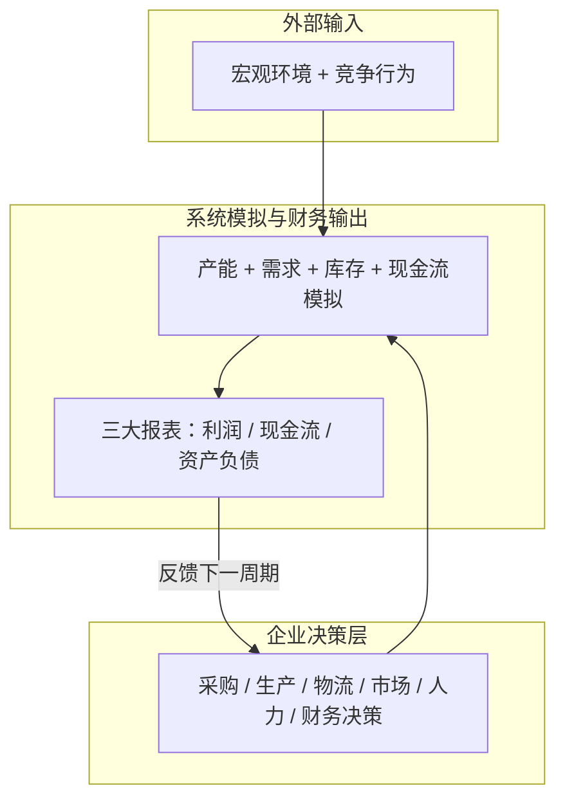
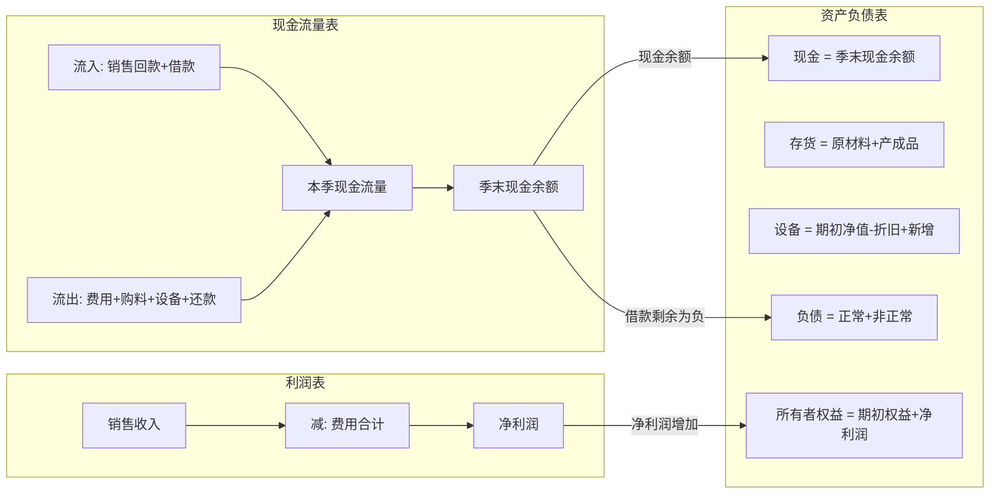

# ERP驱动的制造企业经营仿真与多部门决策优化

> 基于Excel建模的制造企业全链路经营仿真系统，支持8个季度滚动决策与财务三表自动核算。

[](LICENSE)
[](ERP.xlsx)

## 项目简介

本项目来源于**2025年中国大学生工程实践与创新能力大赛（工创赛）企业运营仿真赛道**。比赛要求参赛队伍在统一仿真平台上扮演制造企业核心管理团队，每季度完成**采购、生产、物流、市场、人力资源和财务**六大部门的协同决策，在8个季度内最大化所有者权益，最终根据综合评分决出名次。

赛场上，信息是不对称的——竞争对手的定价、营销力度、产能布局均不可见；宏观经济走势（GDP增长率、CPI波动、季节性需求变化）每季度动态更新；而每一块钱的决策失误都可能造成连锁反应，导致现金流断裂或市场份额永久丢失。

为了在高度不确定的环境中实现科学决策，我基于比赛平台的底层规则，利用**Excel**构建了一套完整的经营仿真与决策优化模型。该模型覆盖了企业运营全链条——从原材料采购、生产线管理、多班次排产，到多区域市场投放、动态定价与营销策略，最终自动生成三大财务报表（利润表、现金流量表、资产负债表），实现经营结果的闭环验证。任意决策变量的改动，都能在三表中实时反映其财务影响。

该项目最终获得**江苏省二等奖**。

## 整体架构

### 决策闭环流程图



### 三表勾稽关系图



## 项目文件结构

```
ERP驱动的制造企业经营仿真与多部门决策优化/
├── ERP.xlsx                              # 经营仿真模型主文件（236行×13列，单Sheet）
├── README.md                             # 项目主文档（本文件）
├── 模型公式说明.md                        # 完整规则体系与公式推导（566行，七章）
├── Excel结构说明.md                       # Excel文件的行级模块映射，帮助快速定位
├── 快速入门指南.md                        # 面向新手的逐步操作教程
├── LICENSE                               # MIT 开源协议
├── .gitignore                            # Git忽略规则
├── 背景.md                               # 原始规则笔记（保留供参考）
├── 2025年工创赛企业运营仿真平台使用指南.pdf  # 比赛官方平台操作手册
└── images/                               # 截图与图示（建议自行补充）
    └── README.md                         # 截图指南
```

## 模型架构详解

整个Excel模型围绕"决策输入 — 经营模拟 — 财务输出"三条主线构建。

### 第一层：决策输入

八个季度纵向排列（第30行至第236行），每季度约26行。每季度包含以下决策变量：

| 部门 | 决策变量 | 说明 |
|------|------|------|
| 采购部 | 正常采购量、非正常采购量 | 正常采购需提前一季下单；非正常采购当季到货但加价1元/单位 |
| 生产研发部 | 计划生产量、研发投入、生产线购置数 | 受产能上限约束，需与班次管理联动 |
| 物流部 | 东部/西部/南部/北部市场投放量 | 四市场投放总和等于计划生产量 |
| 市场部 | 四市场价格、四市场营销投入 | 价格区间5-9元，营销有递延效应 |
| 人力资源部 | 市场人员数、技术工人数 | 每条线需3名工人，每名市场人员上限销售10万件 |
| 财务部 | 借款金额、还款金额 | 借款有所有者权益比例限制 |

### 第二层：经营模拟

Excel公式层实现的五大核心运算：

- **产能动态模型**：当期产能 = 上期产能 × 0.975 + 新增线 × 50000。向下取整，考虑设备折旧与扩张的复合效应。
- **市场响应模型**：需求量由定价（负相关）、营销（正相关，80%当季+20%递延）、上季占有率（惯性效应）、GDP（正比）、CPI（反比）、季节指数（正比）、产品生命周期（正比）共同决定。
- **库存计价模型**：原材料采用移动加权平均法，产成品按标准成本4元/个计价。
- **班次与人工成本**：白班1.2元/个、中班1.4元/个、晚班1.6元/个，模型中取均值1.4元估算。
- **现金流与融资**：当现金不足时自动触发非正常负债（年化利率16%），下季度优先偿还。

### 第三层：财务输出

- **利润表（24项）**：从销售收入到净利润，覆盖研发、人工、原材料、折旧、仓储、利息、各类税费等全部成本项。
- **现金流量表（11项）**：区分经营、投资、融资三类现金流。销售收入仅50%当季到账，投资支出全额当期发生。
- **资产负债表（9项）**：资产端（现金+存货+设备）、负债端（正常+非正常）、权益端，三部分自动平衡。

## 关键特性

**三表自动勾稽。** 利润表的净利润直接驱动资产负债表的所有者权益；现金流量表的季末现金余额等于资产负债表的现金项；借款剩余为负时自动生成非正常负债。三表之间的数据流完全由Excel公式实现，无需手动核对。

**产能折旧与扩张的递归模拟。** 设备每季度折旧2.5%，新购入生产线当季投产。因为折旧基数为上季设备净值，而净值本身又受历史所有购入和折旧决策影响，Excel公式通过逐季引用的方式实现了8季递归计算，与比赛平台的运算逻辑完全一致。

**原材料移动加权平均计价。** 当季单位原材料成本不固定为1.5元，而是根据（期初库存价值 + 本期购料支出）/（期初数量 + 本期采购量）动态计算。当存在非正常采购（加价1元/单位）时，加权成本上升，进而影响利润表中的原材料耗用金额。

**高息短期借款自动预警。** 当季度现金流入不足以覆盖支出时，模型自动计算资金缺口并以非正常负债（年化16%，是正常贷款的4倍）填补。这一机制与比赛平台的"透支"规则一致，可提前暴露现金流风险，避免赛场上因资金链断裂而出局。

**多方案快速对比。** 调整定价策略（7.0-9.0元区间）和投资节奏（研发80-250万、营销0-150万），所有财务结果即时刷新。赛前可通过大量"假设分析"穷举策略空间，找到应对不同宏观经济场景的最优决策组合。

## 决策策略

经过多轮模拟测试形成的策略框架：

| 阶段 | 季度 | 核心思路 | 价格区间 | 研发投入 | 营销投入 |
|------|------|------|------|------|------|
| 积累期 | 1-2 | 控制成本、积累现金、打好产品基础 | 7.7-8.5 | 80-100万 | 50-85万 |
| 扩张期 | 3-5 | 提价放量、加大研发巩固产品竞争力 | 8.8-9.0 | 180-250万 | 0-150万 |
| 收获期 | 6-8 | 降价清库存、削减费用、回收现金 | 6.5-8.8 | 0-120万 | 0-30万 |

详细决策参数表见 `模型公式说明.md` 第六部分。

## 快速开始

1. 下载 `ERP.xlsx`，使用 Microsoft Excel（2016及以上）或 WPS 打开
2. 在每季度决策区填入：定价、营销、投放量、研发、采购量、生产线数、人员数
3. 观察右侧财务三表的实时变化
4. 对比第八季度末的「所有者权益」，选择最优方案

新手建议先阅读 `快速入门指南.md` 了解操作流程，再查阅 `Excel结构说明.md` 熟悉各模块位置。

## 技术栈

Excel建模 · 财务三表联动 · 经营仿真 · 敏感性分析 · 移动加权平均法 · MRP逻辑

## 项目成果

- 实现 8 季度滚动经营仿真，覆盖六大部门协同决策
- 构建"市场—产能—财务"闭环模型，支持策略量化评估与多方案对比
- 获得江苏省二等奖
- 加深了对 ERP 系统中 MRP 运算逻辑、财务三表勾稽关系及制造企业运营决策机制的系统理解

---

有关模型的详细规则推导和公式说明，请参阅 `模型公式说明.md`。
有关Excel文件各模块的具体位置，请参阅 `Excel结构说明.md`。
有关从零开始的操作教程，请参阅 `快速入门指南.md`。
